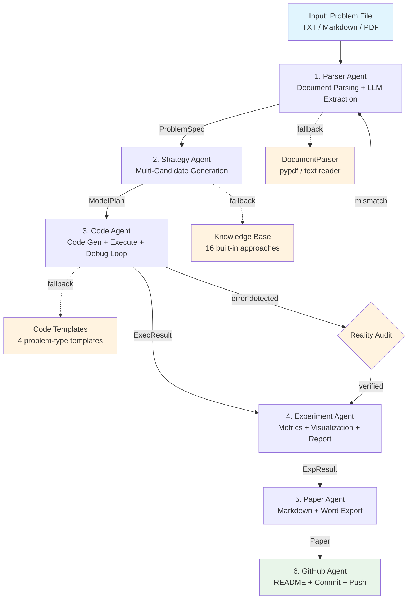

# MathModel Dev Agent

**Self-Correcting Multi-Agent Mathematical Modeling System**

An LLM-powered multi-agent system that automates the entire mathematical modeling workflow — from problem parsing to paper generation — with autonomous error detection and self-correction.

MathModel Dev Agent takes a math modeling problem statement (TXT, Markdown, or PDF) and orchestrates a pipeline of six specialized agents to produce a complete solution. When the system detects a mismatch between its understanding and the actual problem, it triggers a **reality audit** that can re-parse the problem, redesign the mathematical model, and rewrite the solver — all without human intervention.

## Project Overview

MathModel Dev Agent solves math modeling competition problems end-to-end. The system:

1. **Parses** problem statements from PDF/TXT/Markdown into structured specifications
2. **Designs** mathematical models with multiple candidate approaches
3. **Generates** Python solution code and executes it in a sandboxed environment
4. **Analyzes** results with metrics, visualizations, and experiment reports
5. **Writes** formatted papers in Markdown and Word
6. **Version-controls** everything with automatic git commits

The distinguishing feature is the **self-correction mechanism**: a reality audit that compares the system's claimed model against the actual problem, catching misinterpretations before they propagate through the pipeline.

## Architecture



### Context Flow

| Stage | Input | Output |
|-------|-------|--------|
| Parser | Problem file (TXT/PDF) | `ProblemSpec` (title, type, variables, constraints, objective) |
| Strategy | `ProblemSpec` | `ModelPlan` (approaches list, best recommendation) |
| Code | `ModelPlan` + `ProblemSpec` | Executed code + stdout + fix history |
| Experiment | `ExecResult` | Metrics (RMSE/MAPE/R²) + plots + report |
| Paper | All previous outputs | `paper.md` + `paper.docx` |
| GitHub | All outputs | README, changelog, git commit |

## Multi-Agent Workflow

Six specialized agents execute in a fixed DAG:

| Agent | Responsibility | Key Capability |
|-------|---------------|----------------|
| **Parser Agent** | Extract structured problem specs from documents | LLM-based information extraction with fallback to raw text |
| **Strategy Agent** | Generate multiple modeling approaches | Fallback knowledge base with 16 approaches across 4 problem types |
| **Code Agent** | Generate and execute Python solution code | Sandboxed execution with up to 3 rounds of auto-debugging |
| **Experiment Agent** | Compute metrics and generate visualizations | RMSE, MAPE, MAE, R², accuracy; prediction curves, error plots |
| **Paper Agent** | Generate formatted mathematical modeling papers | Markdown output with Word (.docx) export |
| **GitHub Agent** | Automate version control and documentation | README, changelog, project summary, git commit/push |

### Fallback Modes

The system runs without API keys using built-in templates and knowledge bases:

- **Parser**: Extracts raw text from documents (no LLM classification)
- **Strategy**: Matches problem type to 16 pre-built approaches
- **Code**: Uses problem-type-specific templates (optimization, prediction, path planning, statistics)
- **Paper**: Generates structured paper from templates

## Self-Correction Mechanism

The reality audit is the system's key differentiator. It works as follows:

### How It Works

1. **Claim Verification** — After the Strategy Agent recommends a model, the system compares the claimed approach against the actual problem text
2. **PDF Re-read** — The problem PDF is re-parsed with full attention to question text (not just title/keywords)
3. **Mismatch Detection** — If the model doesn't match the problem, the system flags it as a critical risk
4. **Autonomous Rewrite** — The system re-parses the problem, designs new models, and regenerates the solver

### What It Catches

| Error Type | Detection Method | Response |
|------------|-----------------|----------|
| Wrong problem interpretation | Reality audit: PDF re-read | Full re-parse and solver rewrite |
| Numerical divergence | Runtime monitoring (values → billions) | Reduce learning rate, add normalization |
| Poor fit quality | RMS residual check | Wider grid search, multi-start optimization |
| Module not found | Import error detection | Implement from scratch |

### Real-World Demonstration

In the [underwater detection case study](examples/underwater_detection_case/), the system:
- Initially misidentified a "2026 CQUPU" problem as "2025 CUMCM" (both involve underwater acoustics)
- Generated ~900 lines of code for the wrong problem (Snell refraction instead of echo time geometry)
- The reality audit caught the mismatch and triggered a complete rewrite
- The corrected solver (~780 lines) solved all 4 questions correctly

See [CASE_STUDY.md](CASE_STUDY.md) for the full narrative.

## CLI Usage

```bash
# Full pipeline — parse, model, code, experiment, paper
python main.py solve <problem_file> [--project-name NAME] [--verbose] [--debug] [--skills]

# List past runs
python main.py list

# Show details of a specific run
python main.py info <project_dir>

# Backward compatible (alias for solve)
python main.py <problem_file>
```

### Subcommands

| Command | Description |
|---------|-------------|
| `solve` | Run the complete modeling pipeline |
| `list` | List all past solve runs with status |
| `info` | Display detailed info for a specific run |

### Options

| Flag | Description |
|------|-------------|
| `--project-name`, `-n` | Custom project name (default: `mathmodel`) |
| `--verbose`, `-v` | Show detailed agent output |
| `--debug` | Enable debug mode (full traceback on errors) |
| `--skills` | Display active skills in the execution summary |

## Real Case Study

The system has been validated on a real math modeling competition problem:

**Problem**: Underwater Target Detection & Localization (2026 CQUPU Math Modeling A)

| Question | Result |
|----------|--------|
| Q1 — Point nodule localization | Nodule A: (0.75, 79.44, 0) m, B: (1.12, 82.20, 0) m |
| Q2 — Sphere fitting | Center: (20.23, 19.85, -103.46) m, R = 7.52 m |
| Q3 — Echo time function | t(x) = 2√((x-100)² + 12500) / 1500, min = 149.07 ms |
| Q4 — 2D isochrone analysis | Gradient path converges in 101 steps |

The full case study, including the self-correction narrative, is documented in:
- [CASE_STUDY.md](CASE_STUDY.md) — Complete error → audit → rewrite workflow
- [examples/underwater_detection_case/](examples/underwater_detection_case/) — Curated artifacts and key figures

## Outputs

Each `solve` run generates a self-contained directory under `outputs/`:

| File | Description |
|------|-------------|
| `code/solution.py` | Executable Python solution code |
| `code/execution_log.txt` | Execution log with debug history |
| `plots/prediction_curve.png` | Actual vs. predicted comparison chart |
| `plots/error_distribution.png` | Error distribution bar chart |
| `plots/scatter_plot.png` | Actual vs. predicted scatter plot |
| `paper/paper.md` | Mathematical modeling paper (Markdown) |
| `paper/paper.docx` | Paper exported to Word (if `python-docx` installed) |
| `experiment_report.md` | Experiment report with metrics and visualizations |
| `README.md` | Auto-generated project README |
| `PROJECT_DESCRIPTION.md` | Detailed project description |
| `CHANGES.md` | Version changelog |
| `summary.json` | Structured project summary |

## Current Features

| Component | Status |
|-----------|--------|
| Core infrastructure | Complete |
| 6-agent pipeline | Complete |
| Self-correction mechanism | Complete (reality audit + autonomous rewrite) |
| Fallback knowledge base | Complete (16 approaches across 4 problem types) |
| Code auto-debug loop | Complete (max 3 retries) |
| Experiment metrics | Complete (RMSE, MAPE, MAE, R², accuracy) |
| Paper generation | Complete (Markdown + Word export) |
| GitHub automation | Complete (README, changelog, git commit) |
| Unified CLI | Complete (solve / list / info) |
| Execution logging | Complete |
| Visualization (plots) | Requires `matplotlib` dependency |
| LLM integration | Works with API keys; fallback mode without |

## Quick Start

```bash
# Clone and install
git clone https://github.com/1598897031-debug/mathmodel-dev-agent.git
cd mathmodel-dev-agent
python -m venv venv
source venv/bin/activate  # Linux/macOS
# venv\Scripts\activate   # Windows
pip install -r requirements.txt

# Run with a sample optimization problem (no API key needed)
python main.py solve examples/sample_optimization.txt

# Run with a prediction problem and custom project name
python main.py solve examples/sample_prediction.txt --project-name forecast

# List past runs
python main.py list
```

## Project Structure

```
mathmodel-dev-agent/
├── mathmodel/                    # Core package
│   ├── agents/                   # Six specialized agents
│   │   ├── base.py               #   BaseAgent + AgentContext + AgentResult
│   │   ├── parser_agent.py       #   Problem Parser Agent
│   │   ├── strategy_agent.py     #   Modeling Strategy Agent
│   │   ├── code_agent.py         #   Code Execution Agent
│   │   ├── experiment_agent.py   #   Experiment Analysis Agent
│   │   ├── paper_agent.py        #   Paper Writing Agent
│   │   └── github_agent.py       #   GitHub Automation Agent
│   ├── core/                     # Shared infrastructure
│   │   ├── llm_client.py         #   Unified Claude/OpenAI client
│   │   ├── code_executor.py      #   Sandboxed code execution
│   │   ├── document_parser.py    #   PDF/TXT document parser
│   │   ├── plotter.py            #   Matplotlib visualization
│   │   └── project_manager.py    #   Project workspace manager
│   ├── utils/                    # Utility functions
│   │   ├── file_ops.py           #   File operations
│   │   ├── validators.py         #   Input validation
│   │   └── git_ops.py            #   Git operations wrapper
│   ├── templates/                # Prompt and document templates
│   ├── orchestrator.py           # Pipeline DAG orchestration
│   └── config.py                 # Configuration management
├── examples/                     # Sample problem files
│   ├── sample_optimization.txt
│   ├── sample_prediction.txt
│   └── underwater_detection_case/ # Real case study artifacts
├── problems/                     # Problem PDF files
├── tests/                        # Unit tests
├── outputs/                      # Generated run outputs (gitignored)
├── CASE_STUDY.md                 # Self-correction workflow showcase
├── main.py                       # CLI entry point
├── requirements.txt              # Python dependencies
└── .gitignore
```

## Roadmap

### Completed

- [x] Core infrastructure (config, LLM client, code executor, project manager)
- [x] Six-agent pipeline with DAG orchestration
- [x] Self-correction mechanism (reality audit + autonomous rewrite)
- [x] LLM-based problem parsing and structured extraction
- [x] Multi-candidate strategy generation with fallback knowledge base
- [x] Auto code generation with sandboxed execution and debug loop
- [x] Experiment metrics calculation and visualization
- [x] Paper generation (Markdown + Word export)
- [x] GitHub automation (README, changelog, git commit/push)
- [x] Unit tests for all agents
- [x] Unified CLI with solve/list/info subcommands
- [x] Real case study validation (underwater detection)

### Planned

- [ ] Async pipeline execution for parallel agent runs
- [ ] Web UI for interactive problem input and result viewing
- [ ] Support for image-based problems (OCR + chart understanding)
- [ ] Multi-language paper output (English/Chinese)
- [ ] Agent memory and cross-session learning
- [ ] Integration with math modeling competition databases
- [ ] Docker-based execution sandbox for stronger isolation
- [ ] Plugin system for custom agents

## License

MIT License
