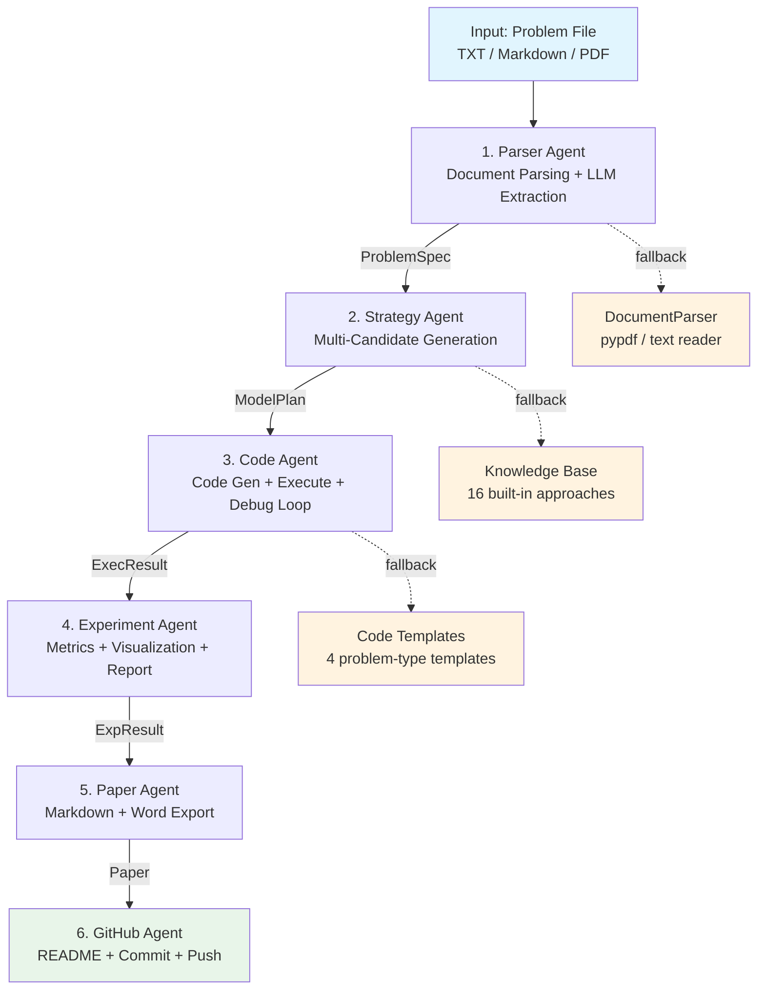
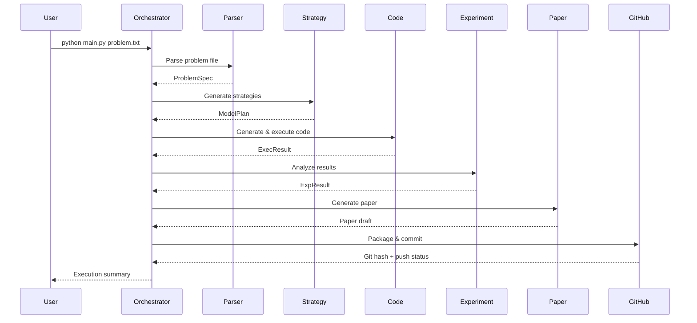

# MathModel Dev Agent

An LLM-powered multi-agent system that automates the entire mathematical modeling workflow — from problem parsing to paper generation.

MathModel Dev Agent takes a math modeling problem statement (TXT, Markdown, or PDF) and orchestrates a pipeline of six specialized agents to produce a complete solution: structured problem analysis, modeling strategy selection, executable Python code, experiment reports with visualizations, a formatted paper (Markdown + Word), and automatic git versioning.

## Features

- **Problem Parser Agent** — Extracts structured problem specifications from TXT/Markdown/PDF files using LLM-based information extraction
- **Modeling Strategy Agent** — Generates multiple candidate modeling approaches with pros/cons analysis and recommends the optimal route; includes a fallback knowledge base for prediction, optimization, path planning, and statistics problems
- **Code Execution Agent** — Auto-generates Python solution code, executes it in a sandboxed subprocess, and performs up to 3 rounds of LLM-assisted debugging on failure
- **Experiment Agent** — Computes evaluation metrics (RMSE, MAPE, MAE, R², accuracy), generates prediction curves, error distributions, and scatter plots
- **Paper Agent** — Produces a full mathematical modeling paper in Markdown and exports to Word (.docx)
- **GitHub Agent** — Auto-generates README, project description, changelog, summary JSON, and performs git commit/push
- **Dual LLM Backend** — Supports Claude (Anthropic) and OpenAI with automatic fallback
- **Fallback Mode** — Runs without API keys using built-in knowledge base templates for all problem types

## Architecture



### Context Flow

| Stage | Input | Output |
|-------|-------|--------|
| Parser | Problem file (TXT/PDF) | `ProblemSpec` (title, type, variables, constraints, objective) |
| Strategy | `ProblemSpec` | `ModelPlan` (approaches list, best recommendation) |
| Code | `ModelPlan` + `ProblemSpec` | Executed code + stdout + fix history |
| Experiment | `ExecResult` | Metrics (RMSE/MAPE/R²) + plots + report |
| Paper | All previous outputs | `paper.md` + `paper.docx` |
| GitHub | All outputs | README, changelog, git commit |

## Workflow



## Installation

```bash
# Clone the repository
git clone https://github.com/1598897031-debug/mathmodel-dev-agent.git
cd mathmodel-dev-agent

# Create and activate virtual environment
python -m venv venv
source venv/bin/activate  # Linux/macOS
# venv\Scripts\activate   # Windows

# Install dependencies
pip install -r requirements.txt

# Configure API keys (optional — runs in fallback mode without keys)
cp .env.example .env
# Edit .env with your API keys
```

### Dependencies

| Category | Packages |
|----------|----------|
| LLM API | `anthropic`, `openai` |
| Document parsing | `pypdf` |
| Scientific computing | `numpy`, `scipy` |
| Visualization | `matplotlib` |
| CLI | `typer`, `rich` |
| Data validation | `pydantic` |
| Testing | `pytest`, `pytest-asyncio` |

## Quick Start

```bash
# Run with a sample optimization problem (fallback mode, no API key needed)
python main.py examples/sample_optimization.txt

# Run with a prediction problem and custom project name
python main.py examples/sample_prediction.txt --project-name population_forecast

# Enable verbose output
python main.py problem.pdf --verbose

# Debug mode (shows full traceback on errors)
python main.py problem.txt --debug
```

## Example

Given a problem file like `examples/sample_optimization.txt`:

```text
某工厂生产两种产品 A 和 B。
生产 A 每件需要 2 小时加工、1 小时组装；
生产 B 每件需要 1 小时加工、3 小时组装。
每周加工工时不超过 120 小时，组装工时不超过 90 小时。
产品 A 每件利润 50 元，产品 B 每件利润 40 元。
求每周最大利润。
```

The pipeline produces:

```
================================================================
  Pipeline Execution Summary
================================================================

  Status:   [OK] Success
  Project:  projects/mathmodel_20260513_153831

  Agent               Status   Time
  ----------------------------------------
  Problem Parser      [OK]     1.2s
  Modeling Strategy   [OK]     0.8s
  Code Execution      [OK]     3.5s
  Experiment Analysis [OK]     2.1s
  Paper Writing       [OK]     4.3s
  GitHub Automation   [OK]     1.7s
  ----------------------------------------
  Total                        13.6s

  Output Files:
    - projects/.../paper/paper.md
    - projects/.../code/solution.py
    - projects/.../experiment_report.md
    - projects/.../README.md
================================================================
```

## Project Structure

```
mathmodel-dev-agent/
├── mathmodel/                    # Core package
│   ├── agents/                   # Six specialized agents
│   │   ├── base.py               #   BaseAgent + AgentContext + AgentResult
│   │   ├── parser_agent.py       #   Problem Parser Agent
│   │   ├── strategy_agent.py     #   Modeling Strategy Agent
│   │   ├── code_agent.py         #   Code Execution Agent
│   │   ├── experiment_agent.py   #   Experiment Analysis Agent
│   │   ├── paper_agent.py        #   Paper Writing Agent
│   │   └── github_agent.py       #   GitHub Automation Agent
│   ├── core/                     # Shared infrastructure
│   │   ├── llm_client.py         #   Unified Claude/OpenAI client
│   │   ├── code_executor.py      #   Sandboxed code execution
│   │   ├── document_parser.py    #   PDF/TXT document parser
│   │   ├── plotter.py            #   Matplotlib visualization
│   │   └── project_manager.py    #   Project workspace manager
│   ├── utils/                    # Utility functions
│   │   ├── file_ops.py           #   File operations
│   │   ├── validators.py         #   Input validation
│   │   └── git_ops.py            #   Git operations wrapper
│   ├── templates/                # Prompt and document templates
│   ├── orchestrator.py           # Pipeline DAG orchestration
│   └── config.py                 # Configuration management
├── examples/                     # Sample problem files
│   ├── sample_optimization.txt
│   └── sample_prediction.txt
├── tests/                        # Unit tests
├── projects/                     # Generated project outputs
├── main.py                       # CLI entry point
├── requirements.txt              # Python dependencies
├── pyproject.toml                # Project metadata
└── .env.example                  # Environment variable template
```

## Outputs

Each run generates a self-contained project directory under `projects/`:

| File | Description |
|------|-------------|
| `code/solution.py` | Executable Python solution code |
| `code/execution_log.txt` | Execution log with debug history |
| `plots/prediction_curve.png` | Actual vs. predicted comparison chart |
| `plots/error_distribution.png` | Error distribution bar chart |
| `plots/scatter_plot.png` | Actual vs. predicted scatter plot |
| `paper/paper.md` | Mathematical modeling paper (Markdown) |
| `paper/paper.docx` | Paper exported to Word (if `python-docx` installed) |
| `experiment_report.md` | Experiment report with metrics and visualizations |
| `README.md` | Auto-generated project README |
| `PROJECT_DESCRIPTION.md` | Detailed project description |
| `CHANGES.md` | Version changelog |
| `summary.json` | Structured project summary |

## Roadmap

### Completed

- [x] Core infrastructure (config, LLM client, code executor, project manager)
- [x] Six-agent pipeline with DAG orchestration
- [x] LLM-based problem parsing and structured extraction
- [x] Multi-candidate strategy generation with fallback knowledge base
- [x] Auto code generation with sandboxed execution and debug loop
- [x] Experiment metrics calculation and visualization
- [x] Paper generation (Markdown + Word export)
- [x] GitHub automation (README, changelog, git commit/push)
- [x] Unit tests for all agents

### Planned

- [ ] Async pipeline execution for parallel agent runs
- [ ] Web UI for interactive problem input and result viewing
- [ ] Support for image-based problems (OCR + chart understanding)
- [ ] Multi-language paper output (English/Chinese)
- [ ] Agent memory and cross-session learning
- [ ] Integration with math modeling competition databases
- [ ] Docker-based execution sandbox for stronger isolation
- [ ] Plugin system for custom agents

## License

MIT License
