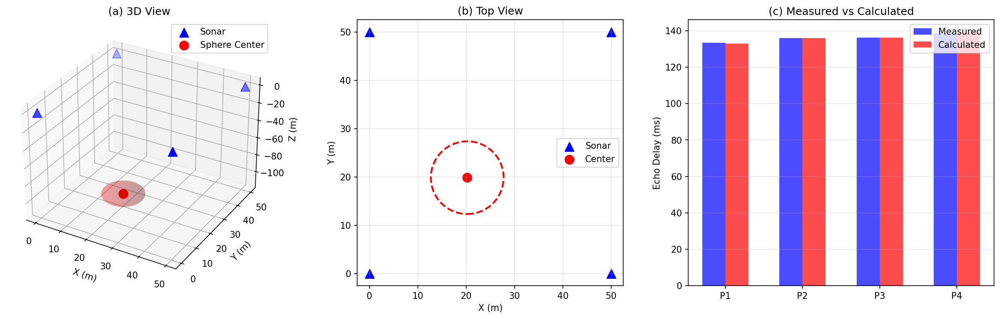

# Demo: Underwater Target Detection & Localization

> A complete demonstration of the MathModel Dev Agent pipeline solving a real math modeling competition problem.

## Problem Overview

| Field | Detail |
|-------|--------|
| **Source** | 2026 CQUPU Math Modeling Competition -- Problem A |
| **Title** | Underwater Target Detection and Localization |
| **Domain** | Deep-sea manganese nodule detection via multi-beam sonar |

## Results

| Question | Method | Result |
|----------|--------|--------|
| **Q1** -- Point nodule localization | Nonlinear least squares | Nodule A: (0.75, 79.44, 0) m, B: (1.12, 82.20, 0) m |
| **Q2** -- Sphere fitting | Grid search + gradient descent | Center: (20.23, 19.85, -103.46) m, R = 7.52 m |
| **Q3** -- Echo time function | Analytical derivation | t(x) = 2sqrt((x-100)^2 + 12500) / 1500, min = 149.07 ms |
| **Q4** -- 2D isochrone analysis | Gradient field + path planning | Converges in 101 steps |

## Key Figures

### Q2: Sphere Fitting


### Q4: Isochrone Analysis


### Comprehensive Summary


## How to Reproduce

```bash
python main.py solve problems/A_underwater_detection.pdf
```

## Self-Correction Demo

This case showcases the system's **reality audit** mechanism:

1. The system initially misidentified the problem as a different competition
2. Generated ~900 lines of code for the wrong problem
3. The reality audit caught the mismatch autonomously
4. Complete solver was rewritten (~780 lines) and solved all 4 questions correctly

See [CASE_STUDY.md](../../CASE_STUDY.md) for the full narrative.

---
*Generated by MathModel Dev Agent*
