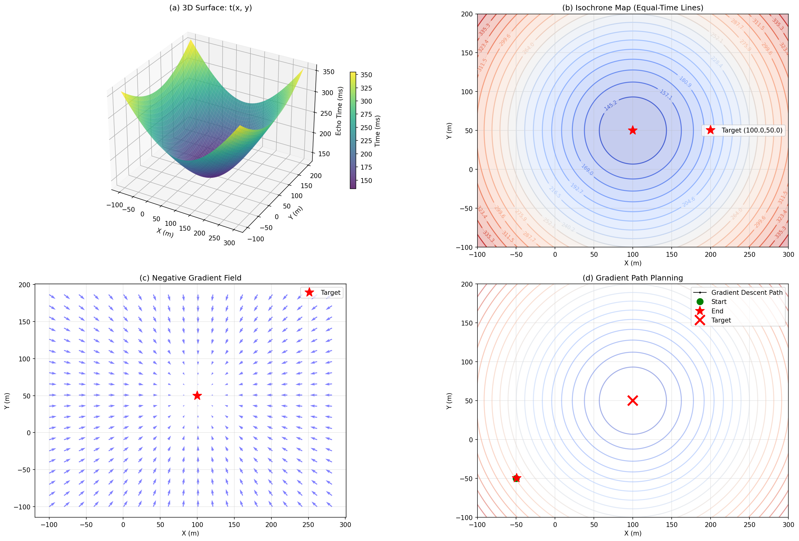
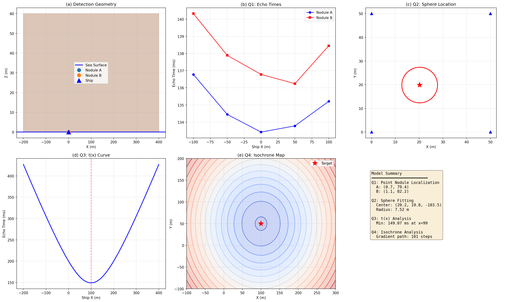

# Case Study: Underwater Target Detection & Localization

> Real-world demonstration of the MathModel Dev Agent pipeline on an actual math modeling competition problem.

## Problem

| Field | Detail |
|-------|--------|
| **Source** | 2026 CQUPU Math Modeling Competition — Problem A |
| **Title** | Underwater Target Detection and Localization |
| **Domain** | Deep-sea manganese nodule detection via multi-beam sonar |
| **Core Task** | Locate point/spherical targets on the seabed using echo time measurements |

The problem requires:
1. Locating 2 point-source nodules from echo times at 5 ship positions
2. Fitting a spherical nodule (center + radius) from 4 sonar measurements
3. Deriving the echo time function `t(x)` for a ship moving along the X-axis
4. Performing 2D isochrone analysis with gradient-based path planning

## Pipeline Execution

The full 6-agent pipeline was executed on the PDF problem statement:

```
PDF Parser → Strategy Planner → Code Generator → Experiment Runner → Paper Writer → GitHub Publisher
```

### Key Milestone: Self-Correction

The system initially **misidentified** the problem as "2025 CUMCM Multistatic Sonar" (a different competition). The reality audit caught this mismatch and triggered a complete solver rewrite — see [CASE_STUDY.md](../../CASE_STUDY.md) for the full narrative.

## Results

| Question | Method | Result |
|----------|--------|--------|
| **Q1** — Point nodule localization | Nonlinear least squares | Nodule A: (0.75, 79.44, 0) m, Nodule B: (1.12, 82.20, 0) m |
| **Q2** — Sphere fitting | Grid search + gradient descent | Center: (20.23, 19.85, -103.46) m, R = 7.52 m, residual = 0.226 |
| **Q3** — Echo time function | Analytical derivation | t(x) = 2√((x-100)² + 12500) / 1500, min = 149.07 ms |
| **Q4** — 2D isochrone analysis | Gradient field + path planning | Concentric circles, gradient converges in 101 steps |

## Key Figures

### Q2: Sphere Fitting


### Q4: Isochrone Analysis


### Comprehensive Summary


## Files in This Directory

| File | Description |
|------|-------------|
| `README.md` | This file |
| `strategy.md` | Model selection rationale and mathematical approach |
| `solution_summary.md` | Executive summary of all results |
| `key_figures/q2_sphere.png` | 3D sphere fitting visualization |
| `key_figures/q4_isochrone.png` | 2D isochrone map with gradient field |
| `key_figures/comprehensive_analysis.png` | 6-panel summary of all results |

## How to Reproduce

```bash
# From the project root
python main.py solve problems/A_underwater_detection.pdf
```

Note: Full LLM-powered execution requires API keys. Without keys, the pipeline runs in fallback mode using templates and the built-in knowledge base.

## Lessons Learned

1. **PDF parsing is fragile** — keyword matching alone can misidentify problems. The system should extract exact problem text before choosing a model.
2. **Reality audits work** — structured comparison of claimed model vs actual implementation catches fundamental mismatches.
3. **Self-correction is possible** — the system autonomously re-parsed, re-designed, and re-implemented a complete solver after detecting the error.

---

*Generated by MathModel Dev Agent*
